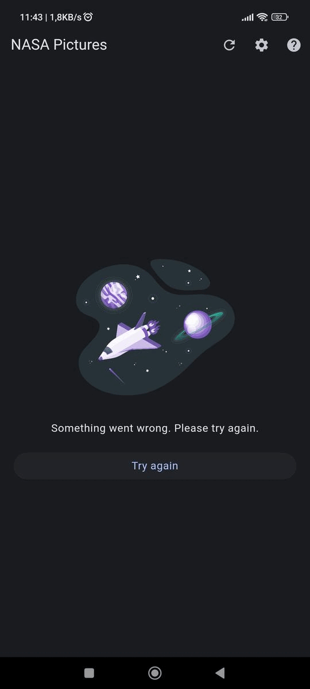
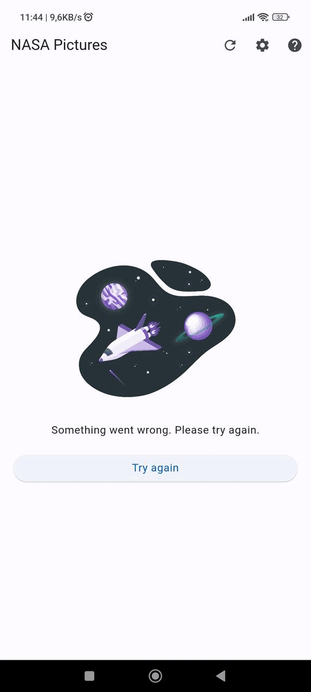

# NASA Pictures - 2nd test of the discipline "Programação 4" at UESPI
[Download APK here](https://github.com/Weslley41/nasa_pictures/releases/download/v1/nasa_pictures.apk)

## Task
Develop a mobile application in Flutter that implements a gallery of space pictures powered by NASA's APOD (Astronomy Picture of the Day) API.

## Students:
- Gabriel Benigno Rocha 
- Weslley de Jesus Souza Morais

## Instructions
```
# Installing dependencies
flutter pub get

# Running the app
flutter run
```

## Technologies used
<div style="display: inline_block">
    
    
</div>

## Assets images from
[@storyset on freepik](https://www.freepik.com/author/stories)

## Screenshots
<div style="display: flex; justify-content: space-around;">
    
    
</div>
